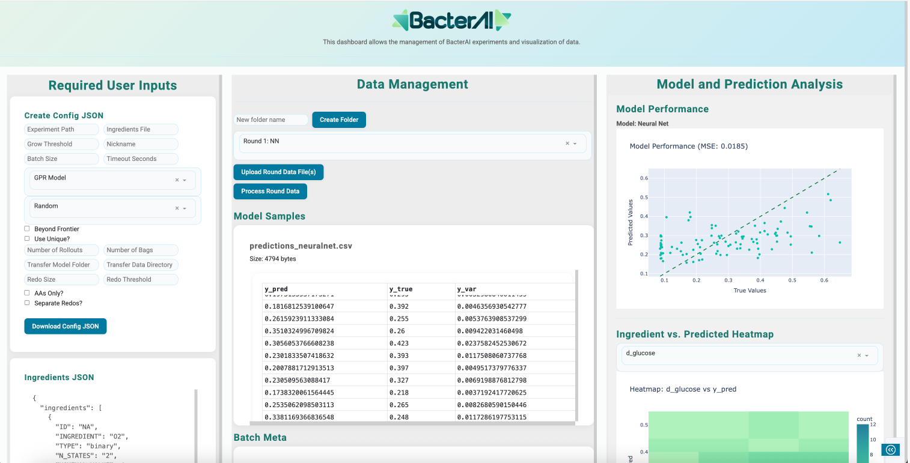

# BacterAI Dashboard 
## 1. Introduction
This dashborad was created for the organization of files input and output files of BacterAI. It allows the user to create their own config.json file required to define and store configuration setting for each experiment ran, while also downloading the required ingredients.json file. The user can also store data in the datamangement section, to organize their experiment rounds and their outputs. Finally with the upload of these files per round the user will be visualize model performance to the right.
## Requirements
- Python 3
- requirements.txt

## 2. Getting Started:
To set up the dashboard it is recommended to create a virtual enviornment in your local machine this can be done by completing the steps below.

### MacOS/Linux:
```Python
#Make directory
mkdir dashboard
cd dashboard
#Create virtual enviornment
python3 -m venv .venv
#Activate
source .venv/bin/activate
#Install required packages
pip install -r requirements.txt
```
### Windows:
```Python
mkdir dashboard
cd dashboard
python -m venv .venv
.venv\Scripts\activate
```
## 2.1 Running the app
Run the app locally by using the following command:

```Python
python app.py
```
## 3. How to use
### Required User Inputs
#### config.json
- For input such as experiment path, ingredients file, transfer model folder, and transfer data directory ensure to input correct experiment paths.
- For checkboxes such as Beyond Frontier, Use Unique, AAs Only, and Seperate redos, check for 'True' or no check for 'False.
#### ingredients.json
- Assure that the universal ingredients.json file is in the the directory and change as needed, then download per experiment.
### Data Management
1. Create a new folder.
2. Select folder and Upload Round Data files(s), then process round data.
3. To ensure that the Model Performance scatter and Heatmal correctly connect to the y_pred and y_true values, run the performance GPR or NN notebooks in BacterAI with data. Then upload the output GPR or NN prediction csv to Data Files in Dashboard.
4. Data will be saved locally, name accordingly.

## Screenshot
