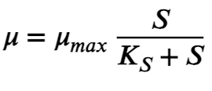
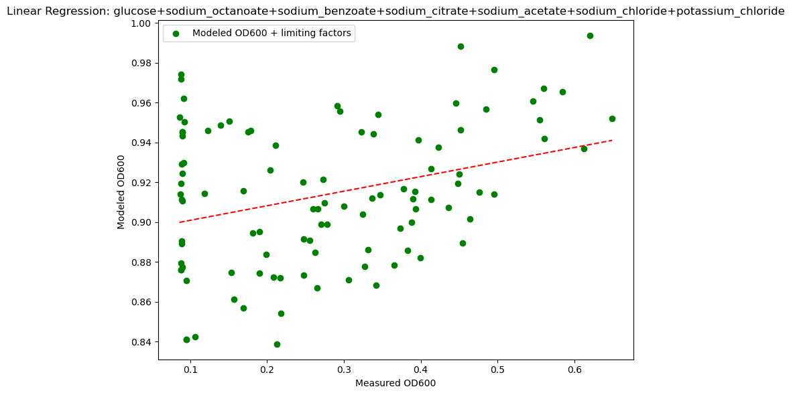
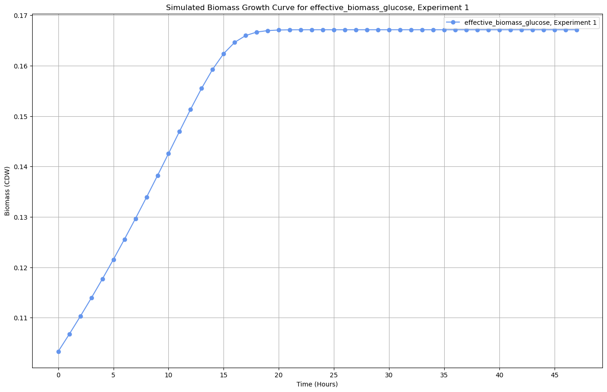

# Genome Informed Model
## Introduction
The purpose of these notebooks were to create a function that can model OD600 based on genome information based on metabolic modeling. These functions focus on using specific mathematical equations obtained from literature as well as using Pyhtons CobraPy package to model these outputs. 
## Workflow Logic
### Data Input
- **Carbon sources**: Glucose, Sodium Citrate, Sodium Octanoate, Sodium Acetate, SOdium Benzoate, Sodium Chloride and Potassium Chloride
- **Uptake Rates**: These rates were optained from CobraPy with the following inputs
``` Python
import cobra
model = cobra.io.load_json_model('path_to_json')

# To get reaction names
print("Reactions in the model:")
for reaction in model.reactions:
    print(reaction.id, reaction.name)

# To Initialize
biomass_reaction = model.reactions.get_by_id("BIOMASS_KT2440_WT3")
print(f"Biomass reaction: {biomass_reaction.name}")
print(f"Biomass bounds: {biomass_reaction.bounds}")
print(f"Biomass objective coefficient: {biomass_reaction.objective_coefficient}")

# To get Uptake rate 
model.reactions.get_by_id("EX_na1_e").lower_bound = -4
model.reactions.get_by_id("EX_glc__D_e").lower_bound = -4
solution = model.optimize()
na_uptake = abs(model.reactions.get_by_id("EX_na1_e").flux)
glc_uptake = abs(model.reactions.get_by_id("EX_glc__D_e").flux)
total_uptake = na_uptake + glc_uptake
print("Total Na + Glucose uptake:", total_uptake)
```
- **Biomass growth**: Biomass growth rate was obtained from CobraPy by doing the following.
```Python
# To get Biomass Growth Rate
print("Biomass growth rate:", solution.objective_value)
```
- **Yield coefficients**: These are obtained by doing the following, which is already done in the modeled_od600_w_limiting function.
```Python
biomass = substrate_conc * (biomass_growth / uptake_rate) 
#in parentheses will calculate for yield coefficient
```
- **Substrate Concentrations**: Are obtained from original data set in units mmol/L.
- **Conversion factors**: These factors were obtained from P. Putida literature. Below are the following resources.

| Carbon Source    | Paper links| 
| -------- | ------- |
| Glucose  | https://link.springer.com/article/10.1186/s12934-015-0207-7|
| Sodium Citrate | https://analyticalsciencejournals.onlinelibrary.wiley.com/doi/full/10.1002/biot.201600720    |
| Sodium Acetate    | https://analyticalsciencejournals.onlinelibrary.wiley.com/doi/full/10.1002/biot.201600720 |
| Sodium Benzoate | https://link.springer.com/article/10.1186/s13068-020-01861-2#Tab1 |
| Sodium Octanoate   | https://www.sciencedirect.com/science/article/pii/S0141813016309576#fig0005|

| Carbon Source    | Conversion Factors| 
| -------- | ------- |
| Glucose  |0.3-0.5|
| Sodium Citrate | 0.38  |
| Sodium Acetate    | 0.27 |
| Sodium Benzoate | 0.8 |
| Sodium Octanoate   |0.35|
### Function Building
- **compute_modeled_od600_w_limiting**: This function computes modeled OD600 values based on substrate concentrations, pH, and Delata OD600 values (y)

| Calculations Completed in Python       | Purpose | Source |
| ---------------- | ------ | ---- |
| biomass = substrate_conc * (biomass_growth / uptake_rate)        |Computes for Biomass per ingredient concentration  | https://www.mdpi.com/2079-3197/12/12/239  |
| pH_factor = np.exp(-((pH - ph_optimal) ** 2) / (2 * ph_stdv ** 2))           |   Computes for a pH factor that considers optimal pH for growth   | https://pmc.ncbi.nlm.nih.gov/articles/PMC9934207/ |
| salt_penalty = salt_penalty * 1 / (1 + (salt_conc * IC50_value))    |Computes for salt penalties in Salt sources    | https://www.mdpi.com/2079-3197/12/12/239 |
|effective_biomass = biomass * pH_factor * salt_penalty|  Will calculate for the most effective biomass considering other sources   | https://www.mdpi.com/2079-3197/12/12/239 |
| od600_cdw = od600 * conversion_factor     |  Converts OD600 to the same units as biomass  |  |
|slope, intercept, *_ = linregress(biomass, od600_cdw)|  Uses linear regression to measure relationship by obtaining slope and intercept   |  |
|modeled_od600 = slope * biomass + intercept|  Models OD600 by using that relationship  |  |

- **simulate_growth**: This function simulates growth based on effective biomass values, substrate consumption and enviornmental factors such as pH and salts. The function used here is the Monod equation which models the growth rate of bacteria that accouns for single lmiting nutrient concentration.

| Equation | Source |
| -------- | ------- |
|  |https://www.mdpi.com/2079-3197/12/12/239|

## Usage and Results

To compute Modeled Delta OD600 use **compute_modeled_od600_w_limiting** be sure to have the dollowing parameters:
- Parameters:
    - **df**: Data frame containing substrate concentrtions, pH and Delta OD600 values (y)
    - **ingredients**: list of ingredients to use for modeling
    - **conversion_factors**: dict mapping ingredients to their conversion factors. (obtained from literature)
    - **uptake_rates**: dict mapping ingredients to their uptake rates (mmol/gDW/hr). (obtained from Cobrapy p. pututda iJN1463 model)
    - **biomass_growth_rate**: dict mapping ingredients to their biomass growth rates (gDW/mmol). (obtained from Coprapy p. pututda iJN1463 model)
    - **ic50**: dict mapping salts to their IC50 values (mmol/L). (obtained from literature)
    - **combinations**: list of tuples containing combinations of ingredients to model.
    - **substrate_concentrations**: dict mapping ingredients to their concentrations in the dataframe.
    - **pH_column**: str, name of the column in df containing pH values.

After running the function select combo name or individual ingredient to obtain OD600 Modeled scatter



To compute a growth simulation use **growth_simulation** after running the previous function, Make sure ot have the following parameters.

- Parameters:
    - **df_biomass_salt**: DataFrame containing effective biomass values for different ingredients.compute_modeled_od600_w_limiting function.
    - **substrate_concentrations**: dict mapping ingredients to their concentrations in the DataFrame.
    - **uptake_rates**: dict mapping ingredients to their uptake rates (mmol/gDW/hr).
    - **hours**: int, number of hours to simulate growth.
    - **excluded_ingredients**: list of ingredients to exclude from the simulation.

After running the simulations select combo name or individual ingredient to obtain a experiment specific growth curve.



